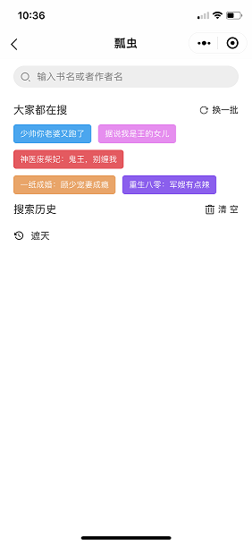
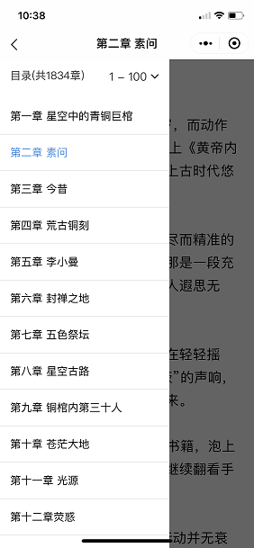

## 说明
### 本小程序使用mpvue开发，ui库使用ivew webapp。
### 后期会考虑使用taro开发另一个版本，如有期望，还会加入react-native版本
### 由于微信限制个人开发者上架文娱-小说类小程序，所以本小程序并未上架，如有想体验的，请加群联系开发者，参与体验。
### QQ群：869427083
## 本小程序内置api为个人写的爬虫，仅供学习适用，后面会生成api文档供学习者使用，目标源为笔趣阁
## api接口请勿商用，如有意外，后果自负！

## Build Setup
## 替换微信appId
## npm install/yarn add
## npm run dev
## 打开微信开发者工具即可看到开发版

## 效果图

